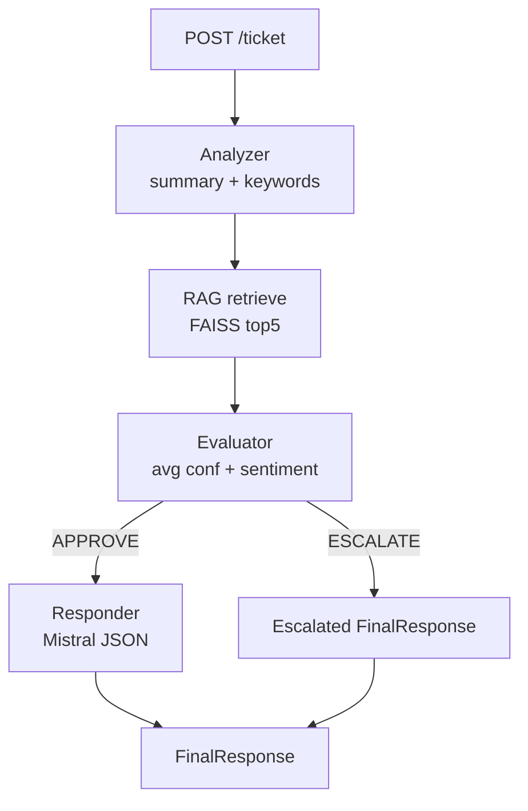

# TCXII-team-6

This project contains the **backend** and the **frontend** for an AI ticketing system agent.


### Getting Started

1. Clone the repository
2. `cd back-end`
3. Install requirements: `pip install -r requirements.txt`
4. Run the server:
    ```bash
    python -m uvicorn app.main:app --reload --host 0.0.0.0 --port 8000
    ```
5. run `cd ../front-end`
6. Install requirements: `npm install`
7. Run the server :  `npm run dev`
8. You can interact with the agent , create tickets and send them via the url shown in the console , eg : [http://localhost:3000](http://localhost:3000) 
### Features

- **Multi-document OCR** - Supports PDF, TXT, and image file processing
- **Intelligent Ticket Pipeline** - Streamlined workflow for:
  - Processing client tickets
  - Responding based on knowledge base
  - Escalating to human support with documented reasons
  - Supports multiple languages


# Ticket System Pipeline Report

## Scope
- Repo contains two FastAPI services (agentic-ai and back-end) sharing the same multi-agent ticket pipeline and two Next.js fronts (front-end and front-end/tc-front).
- This report summarizes exactly what is implemented: request flow, agent responsibilities, RAG/KB ingestion, caching, tests, and UI hooks. No unimplemented or inferred behavior is included.

## Runtime Pipeline (agentic-ai)
1. **API entry**: POST `/ticket` accepts `ticket_id` and `content`, returning `FinalResponse` ([agentic-ai/app/main.py](agentic-ai/app/main.py)).
2. **Orchestrator** routes the call through four stages ([agentic-ai/app/agents/orchestrator.py](agentic-ai/app/agents/orchestrator.py)):
   - Analyze ticket text → `AnalysisResult(summary, keywords)`
   - Retrieve context via RAG → `RagResult(context, sources, similarity_score)`
   - Evaluate confidence/sentiment → `EvaluationResult(decision, confidence_score, reason)`
   - If `APPROVE`, generate final reply; else return escalated response.
3. **Analyzer**: LLM call is stubbed (`call_llm` returns `None`), so a deterministic fallback runs: cleans text, builds a 200-char summary, extracts up to 8 unique non-stopword tokens as keywords ([agentic-ai/app/agents/analyzer.py](agentic-ai/app/agents/analyzer.py)).
4. **RAG retrieval**: Uses FAISS vector store with HuggingFace all-MiniLM-L6-v2. Retrieves top 5 docs with scores, inverts score for a simple rerank, normalizes to [0,1], concatenates snippets into `context`, collects `sources`, and reports max normalized score as `similarity_score` ([agentic-ai/app/agents/rag.py](agentic-ai/app/agents/rag.py)). If no docs, returns `INSUFFICIENT_CONTEXT` and zero score.
5. **Evaluation**: Averages provided snippet confidences (currently five copies of `similarity_score`). Escalates if average < 0.6 or context contains `INSUFFICIENT_CONTEXT`. Attempts sentiment on summary via TextBlob; sentiment < -0.2 triggers escalation; exceptions also escalate. Otherwise approves with reason "Sufficient KB confidence and neutral/positive sentiment" ([agentic-ai/app/agents/evaluator.py](agentic-ai/app/agents/evaluator.py)).
6. **Responder**: Calls Mistral chat model with a strict JSON contract (`response`, `escalate`). Strips code fences, parses JSON, and returns `FinalResponse`. If LLM says `escalate: true`, marks `escalated=True` with reason "Insufficient information to answer the ticket." Otherwise marks answered by automation ([agentic-ai/app/agents/responder.py](agentic-ai/app/agents/responder.py)).
7. **LLM client**: Uses `mistral-small-latest` with API key loaded from `.env` in `app/` (`MISTRAL_API_KEY` required) ([agentic-ai/app/utils/llm.py](agentic-ai/app/utils/llm.py)).
8. **Vector store access**: Lazily loads FAISS index from `vectorstore/` with `allow_dangerous_deserialization=True`. Embedding cache sits in SQLite `embedding_cache.db` with 24h TTL; cache key is SHA-256 of text ([agentic-ai/app/rag/vectorstore.py](agentic-ai/app/rag/vectorstore.py), [agentic-ai/app/rag/cache.py](agentic-ai/app/rag/cache.py)).

### KB Ingestion Pipeline
- Script scans `app/rag/docs/` (subfolders: `policies`, `faq`, `guide`; others become `uncategorized`).
- Supported formats: `.md`, `.txt`, `.pdf`, `.png/.jpg/.jpeg` (PDF via pdfplumber, images via Tesseract OCR).
- Markdown is split into logical blocks, then chunked to ~200 words with 50-word overlap; each chunk stored as a LangChain `Document` with metadata (`source`, `category`, `doc_type`, `chunk_id`).
- Builds FAISS index with normalized L2 embeddings (all-MiniLM-L6-v2) and saves to `vectorstore/` ([agentic-ai/app/rag/ingest.py](agentic-ai/app/rag/ingest.py)).

### Data Flow (simplified)


## Runtime Pipeline (back-end folder)
- Mirrors the same orchestrator, agents, schemas, RAG, ingestion, and LLM code paths as `agentic-ai` ([back-end/app/main.py](back-end/app/main.py), [back-end/app/agents](back-end/app/agents), [back-end/app/rag](back-end/app/rag)).
- Adds FastAPI routers scaffolded under `/api` for auth/users/tickets/admin/dashboard, database settings (MySQL via SQLAlchemy), and password hashing helpers, but these routers and models are not wired into the ticket pipeline. The `/ticket` endpoint in `create_app` uses the same `process_ticket` as above.

## Front-Ends
- **front-end**: Next.js app with a client form sending POST to `http://localhost:8000/ticket` with random `ticket_id` and prefixed `content` (`[TYPE] description`). Displays the `response` field only ([front-end/app/page.tsx](front-end/app/page.tsx)). Includes a static Sign-in page mock ([front-end/app/Signin/page.tsx](front-end/app/Signin/page.tsx)).
- **front-end/tc-front**: Another Next.js app with the same styled ticket form but returns canned responses client-side; does **not** call the backend ([front-end/tc-front/app/page.tsx](front-end/tc-front/app/page.tsx)).

## Tests (agentic-ai)
- **Batch API harness** drives `/ticket` for 50 Arabic queries, expecting batch output format with team name and answers ([agentic-ai/tests/test_agent_with_given_format.py](agentic-ai/tests/test_agent_with_given_format.py)).
- **Full system CLI harness** exercises pipeline stages and prints summaries; note it references `rag_result.answer` which is not present in `RagResult` (context is in `rag_result.context`) and calls `evaluate` with a different signature, so this script will not run as-is without fixes ([agentic-ai/tests/test_full_system.py](agentic-ai/tests/test_full_system.py)).
- **Similarity unit test** builds an in-memory FAISS from sample docs and asserts top-k similarity > 0.8 for a password-reset query ([agentic-ai/tests/unit_tests.py](agentic-ai/tests/unit_tests.py)).
- **eng.json / fr.json** capture sample expected QA outputs (batch format) for English and French variants.

## Notable Behaviors & Constraints
- Analyzer relies on fallback heuristics because `call_llm` is overridden to return `None`.
- RAG filtering in the orchestrator attempts to drop snippets below `cosine_threshold` when `rag_result.similarities` exists, but `RagResult` currently has no `similarities` field; the block is effectively skipped with the current `rag_answer` implementation.
- Evaluator averages five copies of a single `similarity_score`, which may overstate confidence when only one score is available.
- Responder assumes the LLM outputs strict JSON; no retry or guardrails beyond minimal fence stripping.
- Vector store loading uses `allow_dangerous_deserialization=True`; ensure index provenance is trusted.
- Mistral API key is mandatory at import time; missing key raises immediately.

## Suggested Reading Order in Code
1. API entry & orchestrator: [agentic-ai/app/main.py](agentic-ai/app/main.py), [agentic-ai/app/agents/orchestrator.py](agentic-ai/app/agents/orchestrator.py)
2. Agents: analyzer, rag, evaluator, responder in [agentic-ai/app/agents](agentic-ai/app/agents)
3. RAG plumbing & cache: [agentic-ai/app/rag](agentic-ai/app/rag)
4. LLM client: [agentic-ai/app/utils/llm.py](agentic-ai/app/utils/llm.py)
5. Front-end wiring: [front-end/app/page.tsx](front-end/app/page.tsx)
6. Parity copy in `back-end` for deployment scaffolding.
